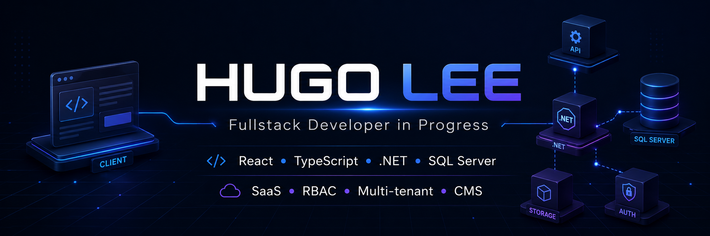

  

<h1 align="center">
  Hey  I'm Hugo Lee
</h1>

<h3 align="center">Fullstack Developer in Progress</h3>

  

  Building scalable web applications with product thinking, clean architecture, and system design.

---

## 📌 About Me

I'm a fullstack-focused developer learning to build real-world web applications using modern frontend, backend, and database technologies.

Currently, I'm working with **React, TypeScript, .NET, and SQL Server**, with a strong interest in **SaaS platforms, multi-tenant systems, authentication, authorization, and CMS/digital publishing systems**.

I care about writing code that is not only functional, but also maintainable, structured, and aligned with real product requirements.

---

## 🧠 What I'm Focused On

- Fullstack Web Development
- SaaS & Multi-tenant Systems
- Authentication & Authorization
- Role-Based Access Control
- CMS / Digital Publishing Systems
- AI-assisted Development Workflow

---

## 🛠️ Languages & Tools

   
  &nbsp;&nbsp;
  &nbsp;&nbsp;
  &nbsp;&nbsp;
  &nbsp;&nbsp;
  &nbsp;&nbsp;
  &nbsp;&nbsp;
  &nbsp;&nbsp;
  &nbsp;&nbsp;
  &nbsp;&nbsp;
  &nbsp;&nbsp;
  &nbsp;&nbsp;
  &nbsp;&nbsp;
  &nbsp;&nbsp;
  

---

## 🚀 Current Direction

I'm currently building my foundation as a fullstack developer through practical web application concepts:

- Modular frontend architecture
- Backend API integration
- Permission-based access control
- Multi-tenant SaaS structure
- Product-oriented development with AI-assisted workflows
